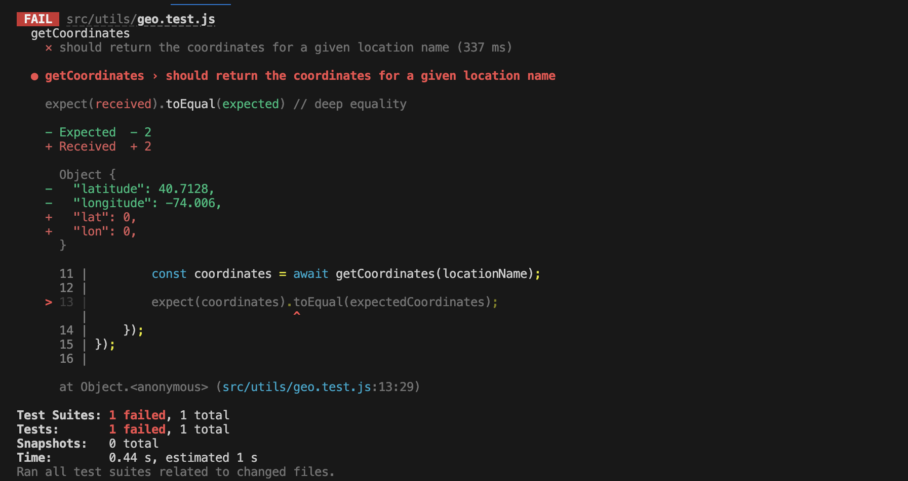

# Documentation of the tests

## Function

The function is to create a simple web application that allows the user to search for a city and display the weather forecast for the next 5 days. The application should be responsive and work on mobile devices.

### the geo functions for the coordinates: 

* Code:
```javascript
export const getCoordinates = async (locationName)=>{
    const url = `https://api.geoapify.com/v1/geocode/search?text=${locationName}&apiKey=b5b8555521e541e89c40f77cc9fb9ae2`;
    const response = await fetch(url, {
        method: 'GET',
        headers: {
            'Content-Type': 'application/json',
        }
    });
    const result = await response.json();
    const lat=result.data?.features[0].properties.lat ?? 0;
    const lon=result.data?.features[0].properties.lon ?? 0;

    return {lat,lon};
}
```

* Test code :
```javascript
import {getCoordinates} from './geo';

describe('getCoordinates', () => {
    it('should return the coordinates for a given location name', async () => {
        const locationName = 'New York';
        const expectedCoordinates = {
            latitude: 40.7128,
            longitude: -74.0060,
        };

        const coordinates = await getCoordinates(locationName);

        expect(coordinates).toEqual(expectedCoordinates);
    });
});

```

* Result :
* 

### the toStringMethods functions for the date:

* Code:
```javascript
export const booleanToString = (value)=>{
    return value ? 'True': 'False'
}

export const verifySameObject = (object1, object2) => {
    return JSON.stringify(object1) === JSON.stringify(object2)
}

```

* Test code :
```javascript
import * as toStringMethods from './toStringMethods';

describe('toStringMethods', () => {
    describe('booleanToString', () => {
        it('should return True if the value is true', () => {
            const value = true;
            const expectedString = 'True';
    
            const string = toStringMethods.booleanToString(value);
    
            expect(string).toEqual(expectedString);
        });
    
        it('should return False if the value is false', () => {
            const value = false;
            const expectedString = 'False';
    
            const string = toStringMethods.booleanToString(value);
    
            expect(string).toEqual(expectedString);
        });
    });
    

    describe('verifySameObject', () => {
        it('should return the number representation of a given value', () => {
            const object1 = { a: 1, b: 2 };
            const object2 = { a: 1, b: 2 };
            const expectedString = true;

            const string = toStringMethods.verifySameObject(object1, object2);

            expect(string).toEqual(expectedString);
        });
    });
});

```

* Result :
* 


